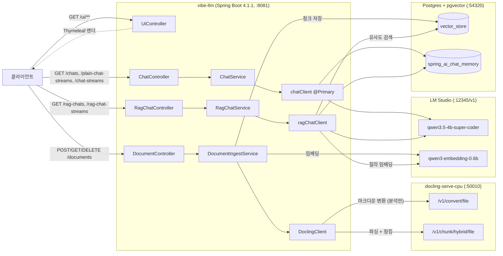
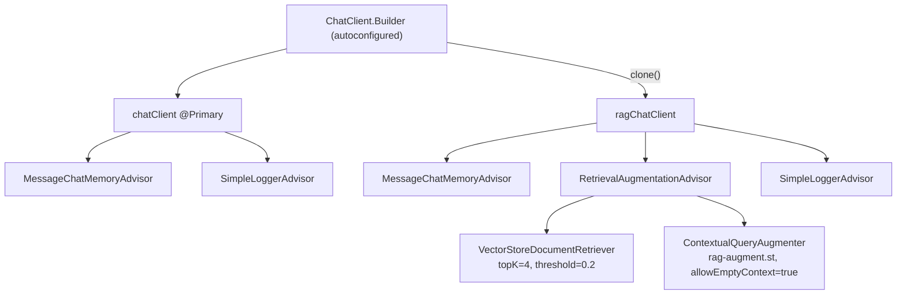
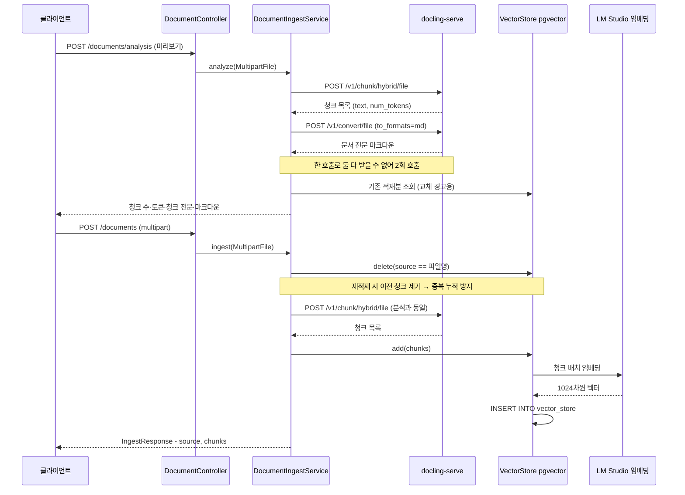
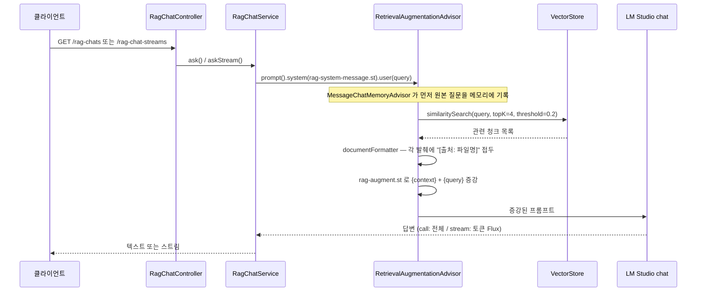

# 아키텍처

## 전체 구조



## 패키지 구조

```
io.vibe.llm
├── Application.java
├── config
│   └── AiConfig.java          # 모든 빈 정의 (ChatClient 2개, ChatMemory)
├── chart                      # 기존 일반 채팅 ("chat" 오타이나 유지)
│   ├── controller/ChatController.java
│   ├── service/ChatService.java
│   ├── advisor/TokenPrintAdvisor.java
│   └── entity/Tutorial.java
├── rag                        # 신설 RAG 모듈
│   ├── controller
│   │   ├── DocumentController.java     # POST/GET/DELETE /documents, POST /documents/analysis
│   │   ├── IngestResponse.java         # record(source, chunks)
│   │   ├── AnalysisResponse.java       # 적재 전 미리보기 + markdown + 중첩 ChunkPreview
│   │   ├── DocumentSummary.java        # record(source, chunks, ingestedAt)
│   │   ├── DeleteResponse.java         # record(source, deleted)
│   │   └── RagChatController.java      # GET /rag-chats, /rag-chat-streams
│   └── service
│       ├── DocumentIngestService.java  # 분석·적재·목록·삭제
│       ├── DoclingClient.java          # docling-serve 파싱·청킹 클라이언트
│       └── RagChatService.java         # 검색 기반 대화 (동기 + 스트리밍)
└── ui
    └── UiController.java      # 화면 라우팅만. 로직 없음
```

기존 `chart` 패키지는 `chat` 의 오타지만, 이름을 바꾸면 모든 기존 파일이 diff 에 섞여
RAG 변경이 묻힌다. 오타를 새 코드로 전파하지 않기 위해 신규 코드는 `rag` 패키지에 두고
기존 패키지는 그대로 두었다. 이름 정리는 별도 커밋 사안이다.

## 리소스

```
src/main/resources
├── application.yaml
├── docker/docker-compose.yml        # pgvector + docling-serve-cpu
├── docker/docker.sh                 # pgvector 단독 기동 (compose 이전 방식)
├── prompt
│   ├── system-message.st            # 기존: Java 코딩 가이드 페르소나
│   ├── user-message.st              # 기존: "{concept} 개념을 상세히 설명해 주세요."
│   ├── rag-system-message.st        # RAG: 근거 기반 답변 페르소나
│   └── rag-augment.st               # RAG: {context} + {query} 증강 템플릿 (한국어)
├── templates                        # Thymeleaf — design.md 참고
│   ├── fragments/layout.html
│   ├── chat.html
│   ├── documents.html
│   └── stream.html
└── static
    ├── css/app.css
    └── js/{chat,documents,stream}.js
```

## 빈 구성 — ChatClient 두 개

`AiConfig` 는 `ChatClient` 를 **두 개** 정의한다.



핵심 포인트:

- `builder.clone()` — 공유 빌더에 default advisor 가 누적되면 기존 `chatClient` 가 오염된다.
- `@Primary` — `ChatClient` 후보가 둘이므로 기존 `ChatService` 의 타입 주입이 모호해지는 것을 막는다.
- `RagChatService` 는 `@Qualifier("ragChatClient")` 를 쓰기 위해 Lombok 대신 생성자를 직접 선언한다.

## 어드바이저 순서

기본 order 를 그대로 쓴다. `MessageChatMemoryAdvisor` 가 먼저, `RetrievalAugmentationAdvisor` 가 나중.

| 어드바이저 | 기본 order |
|---|---|
| `MessageChatMemoryAdvisor` | `HIGHEST_PRECEDENCE + 1000` (큰 음수) |
| `RetrievalAugmentationAdvisor` | `0` |

이 순서가 중요한 이유: 메모리 어드바이저가 RAG 어드바이저보다 먼저 실행되므로
대화 메모리에는 **문서 발췌가 붙기 전의 원본 질문**이 저장된다. 순서가 뒤바뀌면
`maxMessages(5)` 짜리 메모리 창이 발췌 텍스트로 가득 차 대화 맥락이 사라진다.

실측 확인:

```sql
SELECT type, left(content,90) FROM spring_ai_chat_memory WHERE conversation_id='f2' ORDER BY "timestamp";
-- USER 행에 원본 질문이 그대로 저장됨
```

## 데이터 흐름 — 적재



분석과 적재가 **같은 docling 엔드포인트**를 같은 파라미터(전부 기본값)로 호출하므로
미리보기에서 본 청크 경계가 실제 저장 결과와 같다. 마크다운 변환은 분석에만 있고
적재 결과에 영향을 주지 않는다. 화면의 2단계 흐름은 [design.md](design.md) 참고.

적재는 docling 왕복이 동기로 들어가므로 응답이 느리다. 읽기 타임아웃은
`docling.read-timeout`(기본 10m)으로 조정한다.

## 데이터 흐름 — RAG 대화



`ask()` 와 `askStream()` 은 `.call()` / `.stream()` 만 다르고 프롬프트와 어드바이저
체인이 같다. **검색과 증강은 첫 토큰이 나오기 전에 끝난다** — 스트리밍이라고 검색이
나눠 실행되지 않는다. 그래서 RAG 쪽 첫 조각이 일반 대화보다 늦게 도착한다.

## DB 스키마

동일 Postgres 인스턴스에 두 테이블이 공존한다.

### vector_store — Spring AI pgvector 자동 생성

```
 Column    | Type
-----------+--------------
 id        | uuid          (default uuid_generate_v4())
 content   | text          청크 본문
 metadata  | json          {source, ingestedAt}
 embedding | vector(1024)

Indexes:
  vector_store_pkey       PRIMARY KEY btree (id)
  spring_ai_vector_index  hnsw (embedding vector_cosine_ops)
```

`initialize-schema: true` 일 때 `CREATE EXTENSION vector/hstore/uuid-ossp` 와 함께 생성된다.

### spring_ai_chat_memory — JDBC Chat Memory

`spring-ai-starter-model-chat-memory-repository-jdbc` 가 jar 내장 DDL 로 생성한다
(`spring.ai.chat.memory.repository.jdbc.initialize-schema: always`).
`MessageWindowChatMemory` 가 `maxMessages(5)` 창으로 사용한다.

`conversationId` 는 엔드포인트마다 다르게 전달된다 — `/chats` 와 `/plain-chat-streams` 는
`userId` 헤더, `/chat-streams` · `/rag-chats` · `/rag-chat-streams` 는 `conversationId`
쿼리 파라미터. 스트리밍 변형은 원본과 **같은 방식**을 쓴다 — 비교 조건을 맞추기 위해서다.
